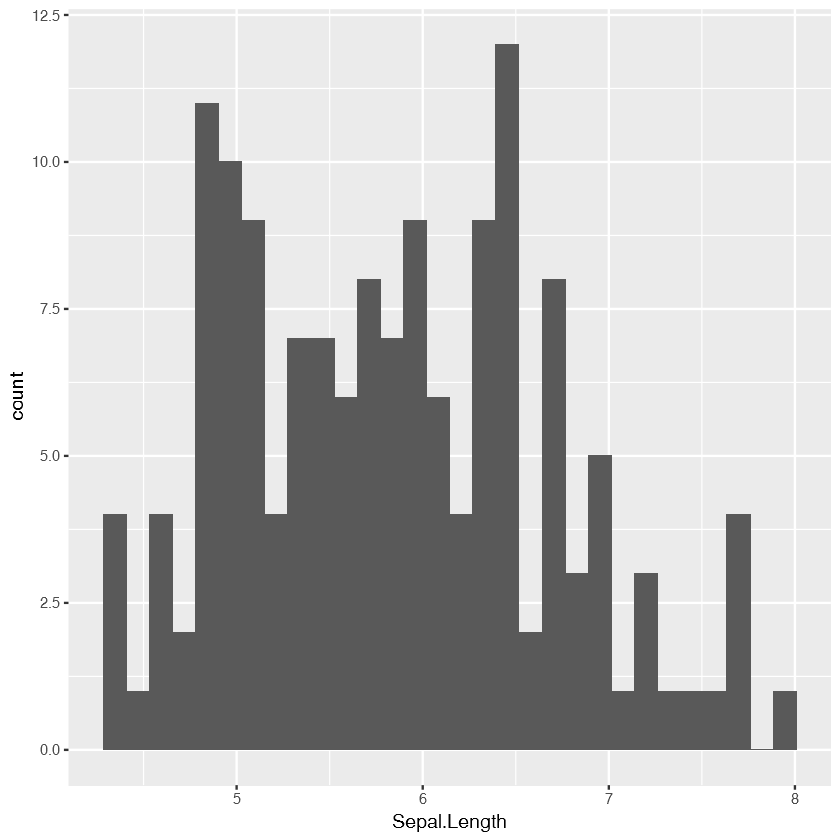
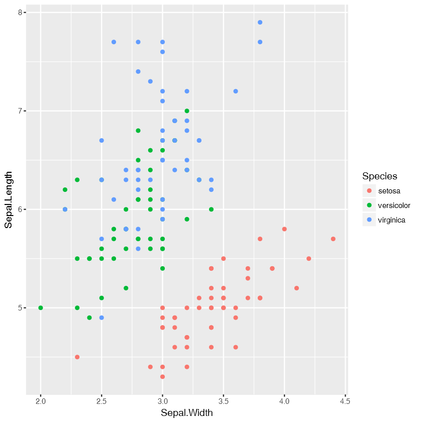

## This Notebook aims to show Jupyter Notebooks working R Programming Language


```R
data(iris)
```


```R
library(dplyr)
library(ggplot2)
```

    Warning message:
    "package 'dplyr' was built under R version 3.4.2"
    Attaching package: 'dplyr'
    
    The following objects are masked from 'package:stats':
    
        filter, lag
    
    The following objects are masked from 'package:base':
    
        intersect, setdiff, setequal, union
    
    Warning message:
    "package 'ggplot2' was built under R version 3.4.2"


```R
summary(iris) 
```


      Sepal.Length    Sepal.Width     Petal.Length    Petal.Width   
     Min.   :4.300   Min.   :2.000   Min.   :1.000   Min.   :0.100  
     1st Qu.:5.100   1st Qu.:2.800   1st Qu.:1.600   1st Qu.:0.300  
     Median :5.800   Median :3.000   Median :4.350   Median :1.300  
     Mean   :5.843   Mean   :3.057   Mean   :3.758   Mean   :1.199  
     3rd Qu.:6.400   3rd Qu.:3.300   3rd Qu.:5.100   3rd Qu.:1.800  
     Max.   :7.900   Max.   :4.400   Max.   :6.900   Max.   :2.500  
           Species  
     setosa    :50  
     versicolor:50  
     virginica :50  
                    
                    
                    


```R
head(iris)
```


<table>
<thead><tr><th scope=col>Sepal.Length</th><th scope=col>Sepal.Width</th><th scope=col>Petal.Length</th><th scope=col>Petal.Width</th><th scope=col>Species</th></tr></thead>
<tbody>
	<tr><td>5.1   </td><td>3.5   </td><td>1.4   </td><td>0.2   </td><td>setosa</td></tr>
	<tr><td>4.9   </td><td>3.0   </td><td>1.4   </td><td>0.2   </td><td>setosa</td></tr>
	<tr><td>4.7   </td><td>3.2   </td><td>1.3   </td><td>0.2   </td><td>setosa</td></tr>
	<tr><td>4.6   </td><td>3.1   </td><td>1.5   </td><td>0.2   </td><td>setosa</td></tr>
	<tr><td>5.0   </td><td>3.6   </td><td>1.4   </td><td>0.2   </td><td>setosa</td></tr>
	<tr><td>5.4   </td><td>3.9   </td><td>1.7   </td><td>0.4   </td><td>setosa</td></tr>
</tbody>
</table>


```R
ggplot(iris) + geom_histogram(aes(Sepal.Length))
```

    `stat_bin()` using `bins = 30`. Pick better value with `binwidth`.
    





```R
ggplot(iris) + geom_point(aes(Sepal.Width,Sepal.Length, color = Species))
```




